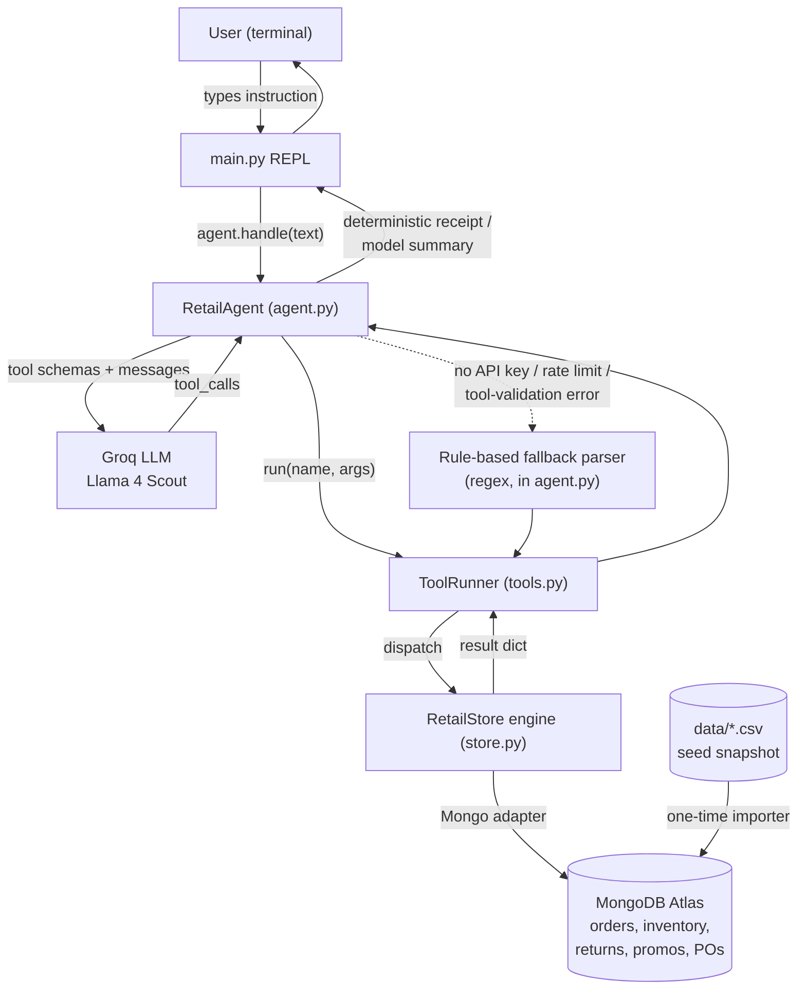
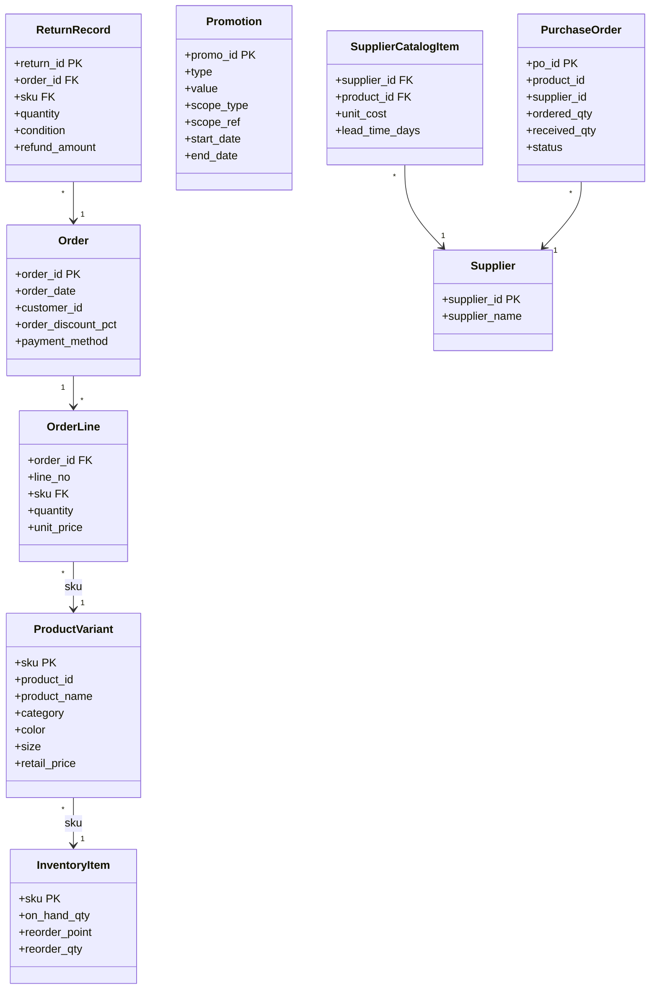
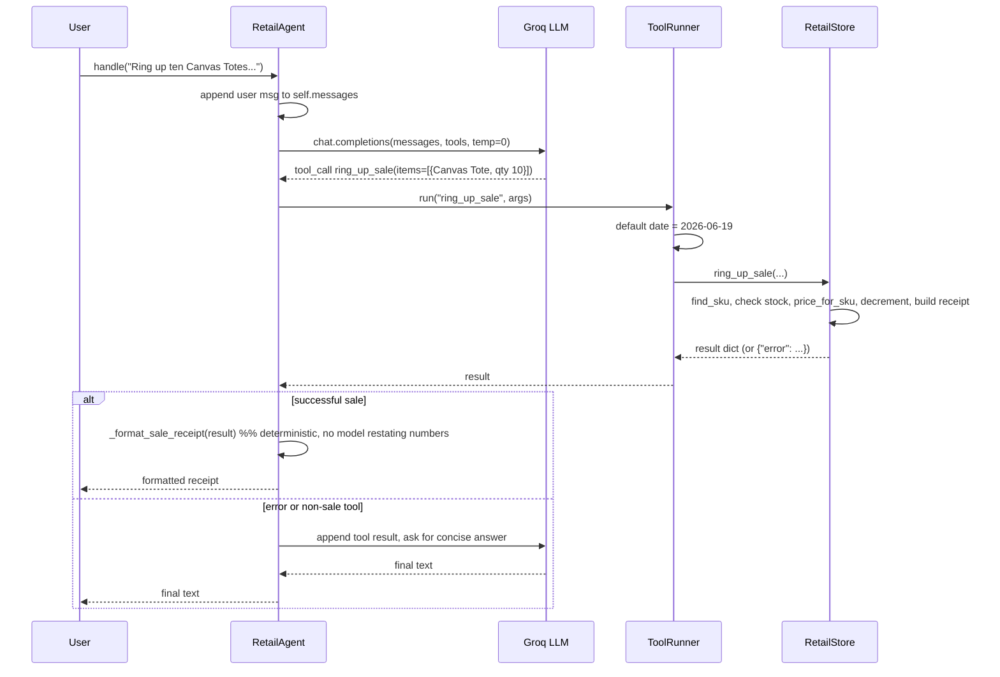
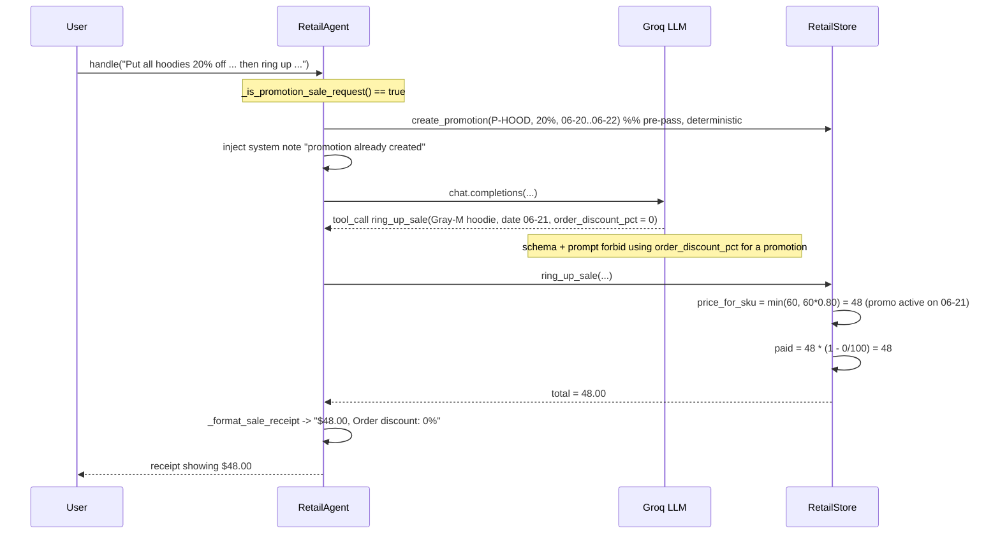
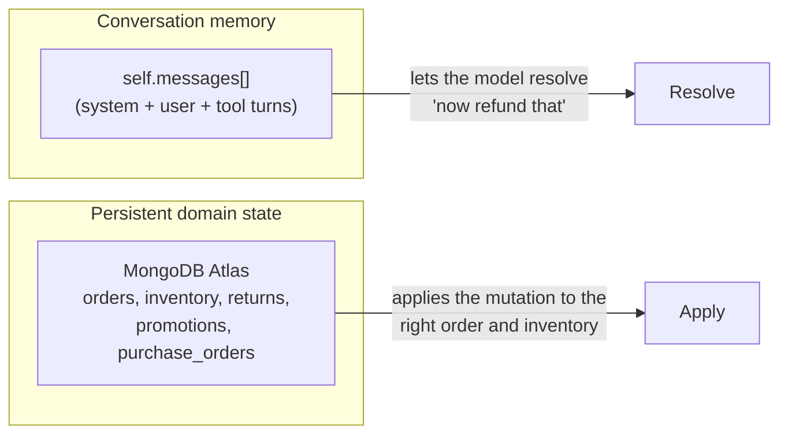
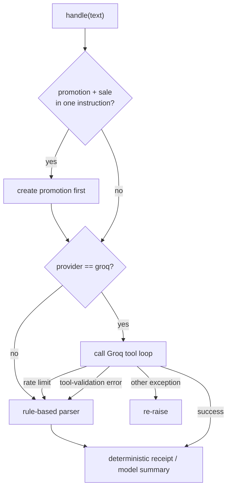

# Design

This document explains how the Retail Store Agent is built: its architecture, the
responsibilities of each component, the domain model, end-to-end call traces, and the
business-rule algorithms that make every answer deterministic.

---

## 1. Guiding principle

> The LLM decides **what** to do. The Python engine decides **what the numbers are.**

Every price, discount, refund, margin, and inventory count is computed by deterministic Python
in `retail_agent/store.py`. The model's only job is to turn a natural-language instruction into a
structured tool call. This separation is what makes the system testable and repeatable: the same
tool arguments always produce the same financial result, regardless of how the model phrases
things.

---

## 2. High-level architecture



**Layered responsibilities**

| Layer | File | Responsibility | Knows about |
|---|---|---|---|
| CLI | `main.py` | Read-eval-print loop, session lifecycle | the agent only |
| Agent | `retail_agent/agent.py` | NL → tool call (via Groq or rules), conversation memory, guardrails, output formatting | tools + LLM |
| Tools | `retail_agent/tools.py` | Tool JSON schemas + name→method dispatch + arg defaults | the store |
| Engine | `retail_agent/store.py` | All business rules, calculations, and mutable state | data + models |
| Persistence | `retail_agent/mongo_store.py` | MongoDB mapping, transactions, conditional updates | engine + MongoDB |
| Model | `retail_agent/models.py` | Plain dataclasses for every entity | nothing |

The dependency arrows only point downward. The engine has no idea an LLM exists, which is why it
can be exercised directly in a plain Python script without any API access.

---

## 3. Domain model

MongoDB records are refreshed into dataclasses and indexed several ways for O(1) lookup during deterministic calculations.



**Modeling decision — variants without special cases.** A "Classic Tee" is one `product_id`
(`P-TEE`) with six `ProductVariant` rows (Blue/Black × S/M/L); a "Canvas Tote" is one `product_id`
with a single variant. Two indexes make both work uniformly:

- `products_by_sku` — the sellable unit a cashier scans (pricing, inventory).
- `products_by_id` — the product family (costing, promotions, supplier choice, stockout rollups).

Pricing/inventory operate on SKU; costing/reordering/promotions operate on `product_id`. Nothing
in the code special-cases "the tote."

---

## 4. Request lifecycle — simple case

A single-action instruction such as *"Ring up ten Canvas Totes for a walk-in."*



The important detail is the `alt` branch: **for a successful sale the agent renders the receipt
itself** and returns immediately. The model never gets a chance to re-type a number, which closes
off a class of "model restates the total wrong" bugs.

---

## 5. Request lifecycle — a multi-step instruction (promote, then sell)

*"Put all hoodies on 20% off from 2026-06-20 to 2026-06-22, then ring up one Gray Medium hoodie
dated 2026-06-21 and tell me the price."*

This is one example of an instruction that needs **two** ordered actions in a single turn: create
the promotion, then sell at the promoted price. It is a good illustration of how the agent
sequences actions and keeps promotions distinct from order-level discounts. (The other non-trivial
rules — variant resolution, refunds, supplier choice, margin, stockout — are covered in §7.) Three
guardrails cooperate here:



Why each guardrail matters:

1. **Promotion pre-pass** (`_ensure_promotion_for_combined_sale`) guarantees the promotion exists
   before the sale, even if the model would otherwise emit the two calls in the wrong order or
   batch them.
2. **`order_discount_pct` discipline** — a "20% off" sale is modeled as a promotion (applied
   automatically by date), not an order-level discount, so the two never compound. The schema
   description and system prompt make this explicit, and the sale carries `order_discount_pct = 0`.
   The order-level discount stays available for the separate case where a whole order is marked
   down at checkout.
3. **Deterministic receipt** ensures the number the user sees is the number the engine computed.

---

## 6. Tool layer

The agent exposes nine tools. `tools.py` holds their JSON schemas and a `ToolRunner` that maps a
tool name to the matching `RetailStore` method and applies argument defaults (e.g. injecting
`2026-06-19` as the date, `2026-05-01..2026-05-31` as "last month").

| Tool | Engine method | Mutates state? | Purpose |
|---|---|---|---|
| `ring_up_sale` | `ring_up_sale` | yes | Create a sale, apply promotions, decrement stock, return a receipt |
| `return_item` | `return_item` | yes | Refund the price originally paid; good returns restock, damaged do not |
| `create_promotion` | `create_promotion` | yes | Add a percent-off product/category promotion |
| `reorder_low_stock` | `reorder_low_stock` | yes | Raise POs for SKUs at/below reorder point, best eligible supplier |
| `receive_purchase_order` | `receive_purchase_order` | yes | Receive stock into a SKU and record PO status |
| `revenue_report` | `revenue_report` | no | Gross revenue, refunds issued, and net revenue for a date range |
| `top_products_by_margin` | `top_products_by_margin` | no | Rank products by profit margin for a date range |
| `stockout_report` | `stockout_report` | no | Flag products below reorder point or under 14 days of cover |
| `inventory_report` | `inventory_report` | no | Current on-hand by SKU |

`ToolRunner.run()` is the single choke point: it parses arguments (string or dict), fills date
defaults, dispatches, and converts any engine `StoreError` into `{"error": "..."}` so a bad
instruction becomes a clear message instead of a crash.

---

## 7. Business-rule algorithms

All money is `Decimal` quantized to the cent with `ROUND_HALF_UP`. The rules below are the
authoritative ones from `DATA_DICTIONARY.md`.

**Pricing — `price_for_sku(sku, date)`**
```
price = retail_price
for each promotion active on `date` that applies to this product/category:
    price = min(price, retail_price * (1 - value/100))
return price            # lowest applicable price wins; promotions never stack
```

**Paid price & refund**
```
paid_unit = round_half_up(unit_price * (1 - order_discount_pct/100))
refund    = paid_unit * returned_quantity      # the price actually paid, not list/current
good return   -> on_hand += qty
damaged return -> on_hand unchanged
```
A return is blocked if `already_returned + qty > line.quantity` (prevents over-returns across the
seed return and any new ones).

**Supplier choice — `_best_supplier(product_id)`**
```
eligible = [s for s in catalog[product_id] if s.lead_time_days <= 10]
return min(eligible, key=unit_cost)            # cheapest that can deliver in time
```
This is why a Tote reorders from Northwind ($7.00, 7-day) rather than the cheaper Pioneer ($6.50,
14-day) — Pioneer is too slow to be eligible.

**Margin — `top_products_by_margin(start, end)`**
```
revenue(product) = sum(paid_unit * qty) - refunds_issued_in_range
cost(product)    = northwind_unit_cost * units_that_stayed_sold   # good returns excluded
margin           = revenue - cost
```
A good (restocked) return is removed from both revenue and cost — it is as if the unit was never
sold.

**Revenue — `revenue_report(start, end)`**
```
gross = sum over orders in range of (paid_unit * qty)
refunds = sum of refund_amount for returns in range
net = gross - refunds
```

**Stockout — `stockout_report()`** (rolled up across a product's variants)
```
velocity   = May units sold
days_cover = on_hand / (velocity / 30)
flag if on_hand <= reorder_point OR days_cover < 14
```

---

## 8. State and memory model

There are two independent kinds of state:



- **Conversation memory** (`self.messages`) gives the LLM the context to resolve follow-ups like
  *"now refund that."*
- **Domain state** plus `last_order_id` / `last_return_id` / `last_purchase_order_id` lets a
  follow-up with no explicit id act on the most recent entity.

The MongoDB adapter refreshes the engine's calculation indexes before each
operation. Mutations are persisted in Atlas, and multi-document operations use
transactions. CSV files remain an idempotent seed source rather than runtime state.

---

## 9. Reliability and error handling



- **Loop safety.** The Groq tool loop tracks successful `(name, arguments)` signatures and stops if
  the model retries a mutation it already completed; it is also hard-capped at five iterations.
- **Graceful degradation.** No API key, a rate-limit error, or a malformed tool call all route to
  the rule-based parser so the program stays usable. The fallback is intentionally narrow (it
  covers the known prompt shapes) and is a safety net, not the primary path.
- **Errors are data, not crashes.** Engine validation failures raise `StoreError`, which the
  `ToolRunner` converts into `{"error": "..."}`. The model relays the message (e.g. *"Insufficient
  stock..."*, *"That product is ambiguous..."*) so the user gets an actionable explanation.

---

## 10. Extension points

The layering makes each of these a localized change rather than a rewrite:

- **Alternative persistence** — implement the `RetailStore` contract behind the
  factory; no agent or tool change is needed.
- **New actions** — add a `RetailStore` method, register it in `ToolRunner.handlers`, and add one
  schema entry in `TOOL_SCHEMAS`.
- **Manual purchase orders / customer creation / fixed-dollar promotions** — engine-level additions
  that slot into the existing tool dispatch.
- **A different LLM** — only `RetailAgent` touches Groq; swapping providers is contained to that
  class.
